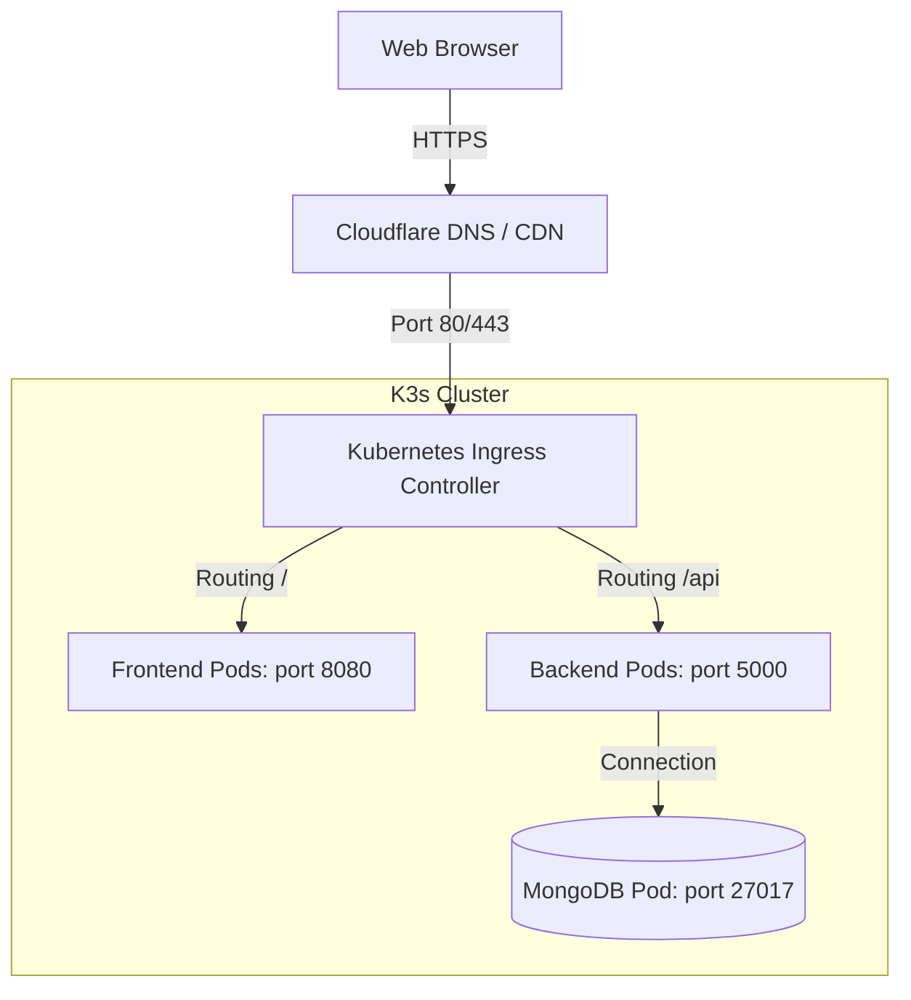

# ☸️ ApexPOS Phased Cloud Deployment Plan (EC2 + k3s + Argo CD)

This document maps out the multi-stage deployment plan to host **ApexPOS** in a cloud production environment using lightweight Kubernetes (k3s), Infrastructure as Code (Terraform), and GitOps delivery.

---

## 🏛️ Deployment Architecture Overview



---

## 🚀 Phase 1: Infrastructure Provisioning (Terraform)

We use Terraform to automate the deployment of security groups, subnets, and instance resources on AWS.

1. **Initialize Terraform**:
   ```bash
   cd devops-repo/terraform
   terraform init
   ```
2. **Review Plan**:
   ```bash
   terraform plan -var="key_name=your-key"
   ```
3. **Apply Configuration**:
   ```bash
   terraform apply -var="key_name=your-key" --auto-approve
   ```
4. **Obtain Cluster Config**:
   Verify outputs and run the generated connection script to fetch the credentials:
   ```bash
   # Extract the kubeconfig locally for management
   ssh -i your-key.pem ubuntu@<EC2_IP> 'sudo cat /etc/rancher/k3s/k3s.yaml' | sed 's/127.0.0.1/<EC2_IP>/g' > ./k3s-kubeconfig
   export KUBECONFIG=$(pwd)/k3s-kubeconfig
   ```

---

## 📦 Phase 2: Deploy Ingress Controller (Nginx)

We disable the default k3s Ingress controller (`traefik`) in our bootstrap scripts to show standard `nginx-ingress` configuration.

1. **Add Nginx Ingress Helm Repository**:
   ```bash
   helm repo add ingress-nginx https://kubernetes.github.io/ingress-nginx
   helm repo update
   ```
2. **Install Ingress Controller**:
   ```bash
   helm install ingress-nginx ingress-nginx/ingress-nginx \
     --namespace ingress-nginx \
     --create-namespace \
     --set controller.service.type=NodePort \
     --set controller.service.nodePorts.http=80 \
     --set controller.service.nodePorts.https=443
   ```
3. **Verify Installation**:
   ```bash
   kubectl get pods -n ingress-nginx
   ```

---

## ⛵ Phase 3: Deploy Application using Helm

You can package and deploy the entire stack using Helm:

1. **Verify Chart Syntax**:
   ```bash
   cd devops-repo
   helm lint helm/apexpos/
   ```
2. **Deploy the Chart**:
   Deploy frontend, backend, and MongoDB database services into the cluster namespace:
   ```bash
   helm install apexpos-prod helm/apexpos/ \
     --namespace apexpos \
     --create-namespace \
     --set ingress.enabled=true \
     --set global.environment=production
   ```
3. **Confirm Pod Status**:
   ```bash
   kubectl get pods,svc,ingress -n apexpos
   ```

---

## 🔄 Phase 4: Configure Argo CD (GitOps Delivery)

Argo CD handles automated synchronization and self-healing for the Kubernetes namespace.

1. **Install Argo CD Operator**:
   ```bash
   kubectl create namespace argocd
   kubectl apply -n argocd -f https://raw.githubusercontent.com/argoproj/argo-cd/stable/manifests/install.yaml
   ```
2. **Access Argo CD Dashboard**:
   Forward the service to local port:
   ```bash
   kubectl port-forward svc/argocd-server -n argocd 8080:443
   ```
   Retrieve administrative password:
   ```bash
   kubectl -n argocd get secret argocd-initial-admin-secret -o jsonpath="{.data.password}" | base64 -d
   ```
3. **Register Application Manifest**:
   Apply the GitOps application manifest defined in your repository:
   ```bash
   kubectl apply -f devops-repo/k8s/argocd-app.yml
   ```
   Argo CD will hook into the repo `https://github.com/Ntharusha/ApexPos_Devops.git`, watch the `k8s` directory, and apply rolling updates on namespace changes automatically.
