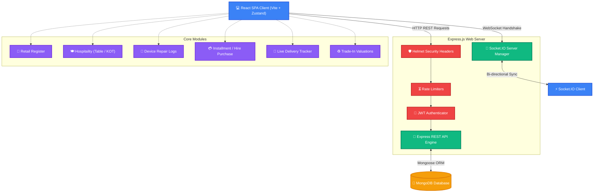
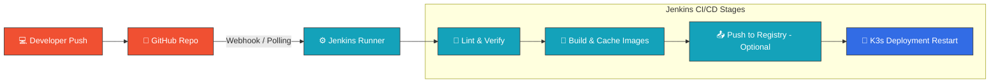

# 🚀 ApexPOS SaaS — Enterprise Point of Sale (POS) & ERP Platform

[](https://react.dev/)
[](https://nodejs.org/)
[](https://expressjs.com/)
[](https://www.mongodb.com/)
[](#)

**ApexPOS** is a modern, real-time, cloud-native Software-as-a-Service (SaaS) Point of Sale (POS) and Enterprise Resource Planning (ERP) platform. Designed for high performance and reliability, it enables businesses to seamlessly scale from single retail outlets to multi-branch franchises, hospitality networks, and service-oriented enterprises.

---

## 🏛️ Application Architecture & Tech Stack

The platform is designed around a decoupled **Client-Server architecture** using the MERN stack with real-time bidirectional communication.



---

## ✨ Key Platform Features

* **⚡ Real-Time Synchronized Registers**: All transactions, inventory updates, and cash drawer actions sync instantly across all branch registers using Socket.IO.
* **📊 Live Rich Analytics**: Business intelligence dashboard utilizing customized `recharts` to track revenue, sales counts, profit margins, and peak hours.
* **🌐 Dynamic Localization**: Full multilingual localization powered by `react-i18next` for seamless global usability.
* **🔐 Role-Based Access Control (RBAC)**: Secure access restrictions for different roles (`super_admin`, `branch_admin`, `manager`, `cashier`, `accountant`, `Technician`) with secure JWT cookies.
* **💸 Dual-Tax Support**: Built-in support for calculations of standard Value Added Tax (VAT) and Social Security Contribution Levy (SSCL) tailored for retail sales.
* **🤝 Business-Specific Add-ons**: Built-in specialized interfaces for mobile repairs, installment sales ledger management, restaurant order routing, and delivery management.

---

## 💻 Tech Stack Breakdown

### Frontend Client
* **Core**: React 19, TypeScript, Vite
* **Styling**: Framer Motion (Fluid Micro-animations & Transitions) + TailwindCSS
* **State Management**: Zustand (Global light-weight reactive store)
* **Routing**: React Router v7
* **Networking**: Axios, Socket.IO Client
* **Analytics**: Recharts
* **Localization**: `react-i18next`

### Backend API Server
* **Runtime**: Node.js & Express.js
* **Database**: MongoDB (utilizing Mongoose ORM models)
* **Realtime**: Socket.IO Engine
* **Security & Auditing**:
  * Helmet (secure HTTP headers)
  * express-rate-limit (DDOS mitigation)
  * bcryptjs (secure salt-round hashing)
  * JSON Web Tokens (session encryption)

---

## 🚀 Getting Started (Local Development)

### Prerequisites
* **Node.js** v18.x or v20.x
* **MongoDB** v6.x running locally on port `27017`

### 1. Setup Repository
```bash
git clone https://github.com/Ntharusha/ApexPOS.git
cd ApexPOS
```

### 2. Configure Backend Server
```bash
cd server
npm install
```
Create a `.env` file inside `server/` using the following:
```env
PORT=5000
MONGODB_URI=mongodb://localhost:27017/apexpos
JWT_SECRET=your_super_secret_jwt_key_change_this
ALLOWED_ORIGINS=http://localhost:5173,http://localhost:80,http://localhost:30080
```
Start backend development:
```bash
npm run dev
```

### 3. Configure Frontend Client
```bash
cd ../client
npm install
```
Create a `.env` file inside `client/` using the following:
```env
VITE_API_URL=http://localhost:5000/api
```
Start frontend development:
```bash
npm run dev
```
Open **`http://localhost:5173`** in your browser.

---

## 📂 Seed Scripts & Admin Credentials

To quickly populate the platform with sample data for demonstration, you can run the built-in seed scripts.

### Running Seed Scripts
From the `server/` directory:

1. **Seed default admin credentials**:
   ```bash
   node seedAdmin.js
   ```
2. **Seed sample business categories and products**:
   ```bash
   node seedProducts.js
   ```

### Default Credentials
* **Super Admin Login**:
  * **Email**: `admin@apexpos.com`
  * **Password**: `admin123`
* **Fast Cashier Terminal Access**:
  * **PIN**: `1234`

---

## 🔄 CI/CD & Deployment Pipeline

This application codebase is designed for continuous deployment via a **declarative Jenkinsfile** located in the root directory.

### Build and Test Pipeline Flow


Detailed Infrastructure configurations (Kubernetes files, Helm charts, Terraform configurations) can be found in the sibling repository:  
👉 **[ApexPOS DevOps Infrastructure Repository](https://github.com/Ntharusha/ApexPos_Devops)**
