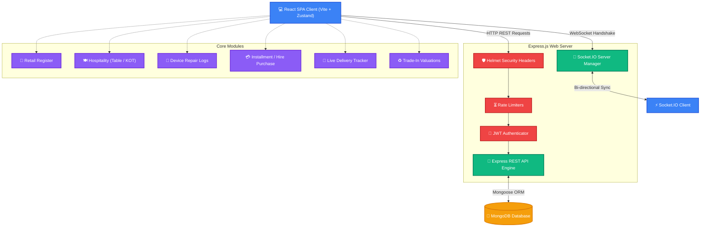
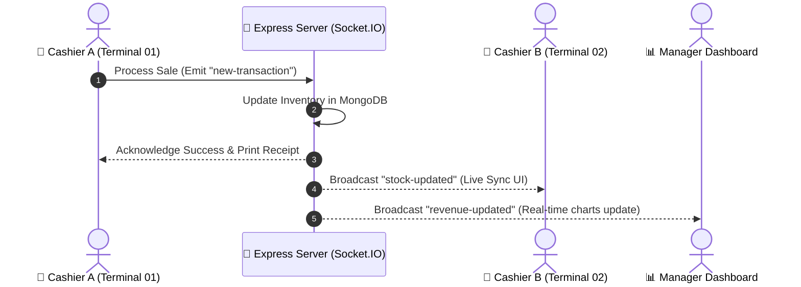
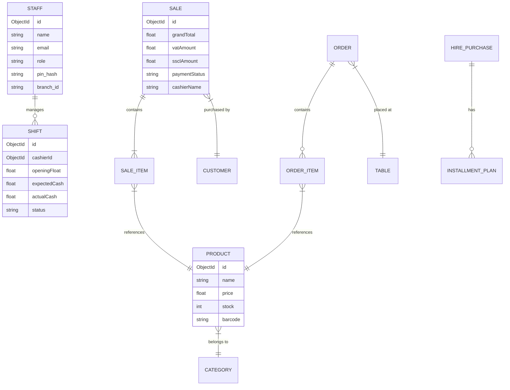

# 🚀 ApexPOS SaaS — Enterprise Point of Sale (POS) & ERP Platform

[](https://react.dev/)
[](https://nodejs.org/)
[](https://expressjs.com/)
[](https://www.mongodb.com/)
[](#)

**ApexPOS** is a modern, real-time, cloud-native Software-as-a-Service (SaaS) Point of Sale (POS) and Enterprise Resource Planning (ERP) platform. Designed for high performance, dual-tax compliance, and seamless multi-branch scalability.

---

## 🏛️ Application Architecture & Tech Stack

The platform is designed around a decoupled **Client-Server architecture** using the MERN stack with real-time bidirectional communication.



---

## ⚡ Real-Time Socket.IO Synchronization Flow

All transactions, inventory status, and active cash register drawer shifts are synchronized live across cashiers and managers using WebSocket events.



---

## 🍃 MongoDB Entity Relationship (ER) Model

The database architecture consists of highly optimized relational models managed via Mongoose ORM.



---

## ✨ Key Platform Features

*   **⚡ Real-Time Synchronized Registers**: Multi-terminal registers synchronize state changes, cash float updates, and order placements instantly.
*   **📊 Live Rich Analytics**: Interactive business intelligence dashboard built with `recharts` for calculating revenue, gross profit, and peak transactions.
*   **🌐 Dynamic Localization**: Dynamic localization switching powered by `react-i18next` for seamless multi-language compatibility.
*   **🔐 Role-Based Access Control (RBAC)**: Fine-grained user role permissions (`super_admin`, `branch_admin`, `manager`, `cashier`, `accountant`, `Technician`) backed by JSON Web Tokens.
*   **💸 Dual-Tax Support**: Sri Lankan tax compliant computation engine calculating Value Added Tax (**VAT - 18%**) and Social Security Contribution Levy (**SSCL - 2.5%**).
*   **🤝 Specialized Industry Add-ons**:
    *   **Mobile Repairs & Service Logs**: IMEI logs, estimated repair costs, status tracking, and technician signature liability pads.
    *   **Hire Purchase & Installments**: Installment plan scheduler, down payments, and due collections ledger.
    *   **Restaurant KOT & Table Management**: Live table status mapping (Available/Occupied/Reserved) and Kitchen Order Tickets (KOT) routing.

---

## 🚀 Getting Started (Local Development)

### Prerequisites
* **Node.js** v18.x or v20.x
* **MongoDB** v6.x running locally on port `27017`

### 1. Setup Repository
```bash
git clone https://github.com/Ntharusha/ApexPOS.git
cd ApexPOS
```

### 2. Configure Backend Server
```bash
cd server
npm install
```
Create a `.env` file inside `server/` using the following:
```env
PORT=5000
MONGODB_URI=mongodb://localhost:27017/apexpos
JWT_SECRET=your_super_secret_jwt_key_change_this
ALLOWED_ORIGINS=http://localhost:5173,http://localhost:80,http://localhost:30080
```
Start backend development:
```bash
npm run dev
```

### 3. Configure Frontend Client
```bash
cd ../client
npm install
```
Create a `.env` file inside `client/` using the following:
```env
VITE_API_URL=http://localhost:5000/api
```
Start frontend development:
```bash
npm run dev
```
Open **`http://localhost:5173`** in your browser.

---

## 📂 Seed Scripts & Admin Credentials..

### Running Seed Scripts
From the `server/` directory:

1. **Seed default admin credentials**:
   ```bash
   node seedAdmin.js
   ```
2. **Seed sample business categories and products**:
   ```bash
   node seedProducts.js
   ```

### Default Credentials
*   **Super Admin Dashboard Access**:
    *   **Email**: `admin@apexpos.com`
    *   **Password**: `admin123`
*   **Fast Cashier Terminal Access**:
    *   **PIN**: `1234`
