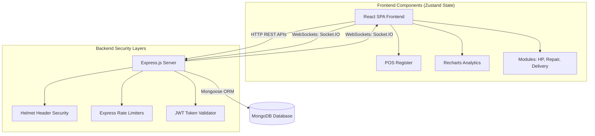
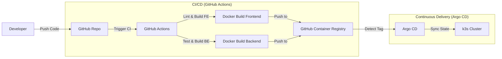

# 🚀 ApexPOS SaaS — Enterprise Point of Sale (POS) & ERP Platform

**ApexPOS** is a modern, real-time, cloud-based Point of Sale (POS) and Enterprise Resource Planning (ERP) platform. Designed as a comprehensive SaaS solution, it scales dynamically from single retail outlets to multi-branch franchises, hospitality networks, and service-based businesses.

Built with a focus on high performance, real-time synchronization, and a premium user experience.

---

## 🏛️ Application Architecture Diagram

The application leverages a React/Vite client communicating over HTTP REST APIs and real-time WebSockets to a Node/Express backend backed by MongoDB.



---

## ✨ Key Platform Features

* **⚡ Real-Time Synchronization**: Seamless updates across multiple registers and locations using WebSockets (Socket.IO).
* **📊 Analytics Dashboard**: Visualize business KPIs, sales trends, and profit margins instantly with interactive graphs (Recharts).
* **🌍 Internationalization (i18n)**: Out-of-the-box multilingual support for global localization.
* **🔐 Role-Based Access Control**: JWT-secured sessions with Cashier Shift Management to track cash registers.
* **🖨️ Hardware Integrations**: Native support for receipt printing and barcode scanner inputs.

---

## 🛠️ Specialized Business Modules

ApexPOS includes specialized industry modules out of the box:
* **🛒 Retail Core**: Product variants, inventory counts, categories, and fast checkouts.
* **🍽️ Hospitality**: Table layout design, kitchen routing, and dining workflows.
* **🔧 Repairs & Services**: Customer device repair progress logs, billing, and status updates.
* **🚚 Delivery Tracking**: Order dispatch, driver assignments, and delivery statuses.
* **💳 Hire Purchase (HP) & Installments**: Customer installment calculations, payback tracking, and ledger entries.
* **♻️ Trade-ins**: Evaluate customer items and trade for store credit instantly.

---

## 💻 Technical Stack

### Frontend Client
* **Framework**: React 19 + Vite
* **Styling**: Tailwind CSS + Framer Motion (Fluid Micro-animations)
* **State Management**: Zustand
* **Routing**: React Router v7
* **Sockets**: Socket.IO Client
* **Visualization**: Recharts
* **Localization**: `react-i18next`

### Backend Server
* **Runtime**: Node.js + Express.js
* **Database**: MongoDB (Mongoose ORM)
* **Auth**: JWT (JSON Web Tokens) & bcryptjs
* **Engine**: Socket.IO
* **Security**: CORS, Helmet security headers, Express Rate Limiters

---

## 🚀 Getting Started (Local Development)

### Prerequisites
* Node.js (v18 or higher)
* MongoDB (Local instance or MongoDB Atlas Cluster)

### 1. Clone the Repository
```bash
git clone https://github.com/Ntharusha/ApexPOS.git
cd ApexPOS
```

### 2. Backend API Setup
```bash
cd server
npm install
```
Copy `server/.env.example` to `server/.env` and edit configurations:
```env
PORT=5000
MONGODB_URI=mongodb://localhost:27017/apexpos
JWT_SECRET=your_super_secret_jwt_key
ALLOWED_ORIGINS=http://localhost:5173,http://localhost:80,http://localhost:30080
```
Start the backend API development server:
```bash
npm run dev
```

### 3. Frontend Client Setup
```bash
cd ../client
npm install
```
Copy `client/.env.example` to `client/.env`:
```env
VITE_API_URL=http://localhost:5000/api
```
Start the frontend client dev server:
```bash
npm run dev
```
Access the client dashboard at `http://localhost:5173`.

---

## ☁️ DevOps Architecture & Production Deployment

For cloud environments, the application is containerized and managed via standard Kubernetes configurations and continuous integration.

### DevOps Pipeline & GitOps Flow



### Free-Tier Production Cost Optimization

To host this project completely for free during the staging/testing phase, we utilize the following free-tier cloud configurations:

| Service | Free Tier Details | Duration | Purpose |
|---------|------------------|----------|---------|
| **AWS EC2** | 750 hrs/mo of t2.micro/t3.micro | 12 months | Cluster Node Host |
| **AWS EBS** | 30 GB of gp3 storage | 12 months | Persistence Storage |
| **MongoDB Atlas** | M0 Cluster (512 MB, Shared) | Always free | Managed Database |
| **Let's Encrypt** | Certbot TLS Certificates | Always Free | SSL Encryption |
| **Cloudflare** | DNS & CDN Proxy | Always free | Global Edge Security |
| **GitHub Packages** | Container Registry (GHCR) | Always free | Image Storage |

### 📖 Deployment Documentation

Detailed setup guides and orchestration manifests are located here:
👉 **[Phased Kubernetes Implementation Plan](./IMPLEMENTATION_PLAN_EC2_K8S.md)** — Step-by-step cluster setup, Terraform scripts, and Argo CD configurations.  
👉 **[Zero-Cost Deployment Reference](./ApexPOS_Deployment_Plan_Free_Tier.md)** — DNS, Let's Encrypt certificate mounting, and managed database connections.

---

## 🔄 How to Work This System (Workflow)

This system is divided into two distinct repositories to separate your application logic from your DevOps infrastructure. Here is the day-to-day workflow:

### 1. Making Application Changes (Frontend/Backend)
* **Local Development**:
  1. Open your code in `ApexPOS` on your local machine.
  2. Start the backend (`cd server && npm run dev`) and frontend (`cd client && npm run dev`) to test features locally.
* **Production Deployment**:
  1. Stage, commit, and push your changes:
     ```bash
     git add .
     git commit -m "feat: add new transaction modules"
     git push origin dev
     ```
  2. **CI/CD Automation**: GitHub Actions runs automatically to lint code, compile Docker containers, push the new images to GitHub Packages (`ghcr.io`), and trigger a zero-downtime rolling restart in your Kubernetes cluster.

### 2. Making Infrastructure/DevOps Changes
* If you need to modify server specs, Kubernetes configurations, or Helm charts:
  1. Open the [devops-repo](https://github.com/Ntharusha/ApexPos_Devops) sibling directory.
  2. Make changes to Terraform scripts, Helm templates (`values.yaml`), or Kubernetes manifests.
  3. Push changes to GitHub:
     ```bash
     git add .
     git commit -m "config: increase backend memory allocation"
     git push origin main
     ```
  4. **GitOps Automation**: **Argo CD** automatically detects your changes, pulls the new manifests, and synchronizes the cluster state without you ever needing to run manual deployment commands!

---

## 📄 License

This project is proprietary and confidential. Unauthorized copying of files, via any medium, is strictly prohibited.
